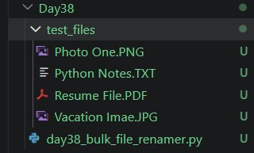
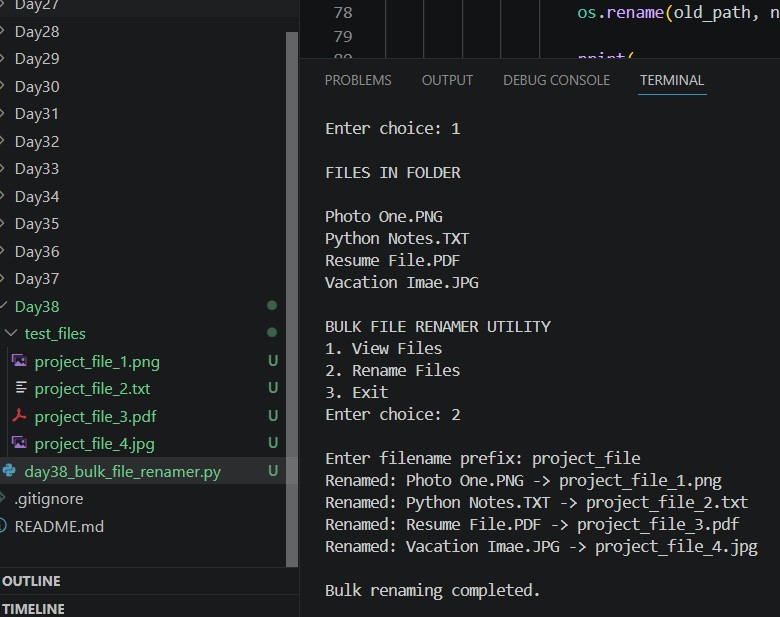

# Day 38 
## Bulk File Renamer Utility

First time touching the `os` module properly.

Until now everything I built lived inside Python — lists, dicts, loops, classes. Today the code actually reached out and touched the real files on my computer. That felt different.

---

## What it does

Point it at a folder, view the files inside, then give it a prefix and it renames every file automatically. `Photo One.PNG` becomes `project_file_1.png`, `Resume File.PDF` becomes `project_file_3.pdf`, and so on. Extensions are preserved and lowercased, spaces get replaced with underscores.

I tested it on a `test_files/` folder with 4 actual files. It worked exactly as expected you can see the output in the terminal screenshot.

---

## the os module stuff

```python
filename, extension = os.path.splitext(file)
os.rename(old_path, new_path)
```

`os.path.splitext()` splits a filename into its name and extension cleanly so you can modify one without breaking the other.

`os.rename()` does the actual renaming on disk. no confirmation, no undo. that made me careful about testing it properly before running it on real files.

`os.path.join()` builds file paths correctly — important because hardcoding paths with `/` or `\` breaks across different systems.

---

## small detail that mattered

```python
cleaned_name = prefix.lower().replace(" ", "_")
```

If someone types `My Project` as the prefix, it becomes `my_project` — not `My Project_1.png` with a space in the filename. File naming conventions matter in real systems. learned it the practical way today.

---

## file structure

```
Day38- test_files- project_file_1.png
                   project_file_2.txt
                   project_file_3.pdf
                   project_file_4.jpg
     - day38_bulk_file_renamer.py
```

Tested it on a test_files/ folder I created inside Day38/ — had four files with random messy names in it. Then ran the renamer, all four got renamed cleanly. I kept the folder in the repo so the project actually makes sense when someone opens it.

---

**Before Renaming:**





**After Renaming:**




---

*day 38* 