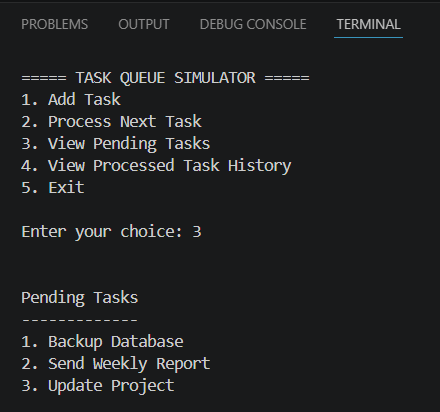
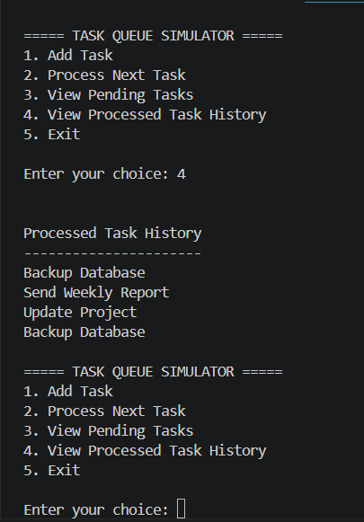

# Task Queue Simulator

### About

Task Queue Simulator is a command-line application built in Python that demonstrates how a queue works using the First In, First Out (FIFO) principle. It allows users to add tasks, process them in order, view pending tasks, and keep a history of completed tasks in a text file.

This project was created to practise writing cleaner Python code using type hints while improving program organisation through reusable functions and file management with "pathlib".

---

### Features

- Add new tasks to the queue
- Process tasks using FIFO order
- View all pending tasks
- Save completed tasks to a history file
- View processed task history
- Input validation for task names
- Automatic creation of required project folders
- Clean and modular function-based design

---

### Concepts used in this project

- Python Type Hints
- Variable Annotations
- Lists
- Queue (FIFO)
- Functions
- File Handling
- Pathlib
- Input Validation

---

### Project Structure

Day48/
│
├── day48_task_queue_simulator.py
│
└── data/
    └── processed_tasks.txt

---

### How to run

1. Open the project folder.
2. Run "day48_task_queue_simulator.py".
3. Choose an option from the menu.
4. Add tasks, process them and view the saved history.

#### Application menu

#### Processed task history

---

### What I learned

Through this project, I learned how type hints improve code readability without enforcing data types at runtime. I also understood how a queue processes tasks using the FIFO principle and how to organise a Python project into small, reusable functions. In addition, I practised storing processed data in a text file using modern file handling with "pathlib".

---

### Future Improvements

In future I may also include these in my project-Task Queue Simulator: 
- Add task priorities
- Store pending tasks permanently between program runs
- Record the date and time when each task is processed
- Add an option to delete or edit pending tasks 

---
